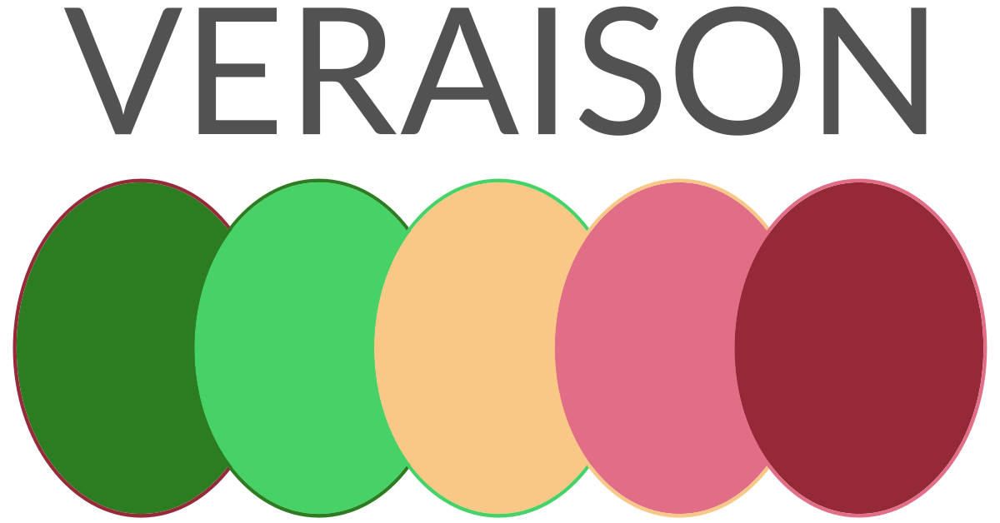

Project Veraison (**VER**ific**A**t**I**on of atte**S**tati**ON**) builds
software components that can be used to build an Attestation Verification
Service.

## Background

Attestation is the system by which an entity produces evidence about itself
that another party can use to evaluate the trustworthiness of that entity. A
critical part of establishing trust based on that evidence is Verifying what is
presented to ensure it meets a policy established to prove trustworthiness. The
act of Verification will often require comparing evidence against reference
values or checking cryptographic signatures from a known trust anchor. This is
a complex task to be performed by an arbitrary user of a system and it is often
delegated to a trusted Verification Service instead. The nature of the Service
will depend upon the deployment - it may be a local software component or it
may reside as a network or internet accessible component. The Verification
Service will need up to date data for the process of appraising the evidence
presented to it. This must be obtained from authoritative sources, which
normally implies establishing business relationships between the Verification
Service and those sources.

## What part does Veraison play in this?

Given the above, it can be challenging to build just one Verification Service
solution which can address all deployments for a technology that needs to
produce Attestation reports to prove its trustworthiness. If that then implies
that each deployment needs a custom service, there is a significant software
barrier and hence cost of entry to establishing a system that can be used in a
secure manner. Veraison aims to provide consistency and convenience to solving
this problem by building the software components that can be used to build
Attestation Verification Services. The components encompass a core structure of
verification and provisioning pipelines that can be extended to support
specific attestation technologies by the use of plugins. The core components
relate to the deployment environment via abstractions.The Veraison project will
build some reference implementations in order to prove the integration
principles of those components. The reference implementations will not be
production quality, but may provide a convenient basis for substantive
deployments.

## Why "Veraison"?

Veraison (pronunciation "ver-ayy-sjon") is a term used in winemaking to
indicate the point at which grapes start to ripen. It was chosen for this
project mainly because it could fit into the project intent (verification of
attestation) and because it didn't clash with any other project name. There is
also an allegorical aspect about good/bad verifications being reflected by ripe
/ unripe states or even common uses of green / red colours, but musing on such
interpretations is left to the reader!

## Feedback

Source code for this book is located on [GitHub](https://github.com/veraison/book).
Please submit any feedback via issues or updates via pull requests there.

