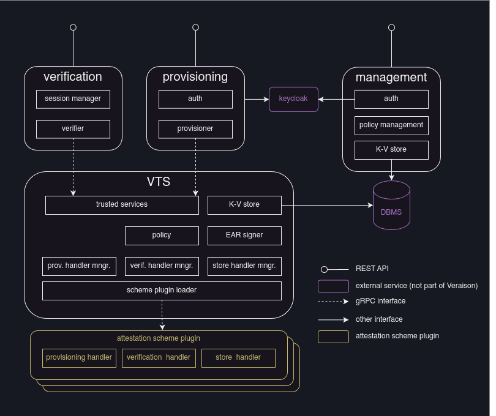

# Architecture

Veraison services consist of the following

- a provisioning service that provides provisioning REST API
- a verification service that provides challenge/response REST API
- a VTS (Veraison Trusted Services) service that serves a trusted backend for
  the above
- a management service that provides policy management API
- a number of attestation scheme plugins

Optionally, a Keycloak server can be used for authentication, and a PostgreSQL
or MySQL/MariaDB DBMS can be used for endorsements, trust anchors, and policies
stores.

Veraison broadly adheres to [RATS
architecture](https://www.ietf.org/rfc/rfc9334.html), with the following
exceptions:

- RATS separates provisioned artefacts into Endorsements and Reference Values.
  Veraison separates them into Endorsements and Trust Anchors. An "endorsement"
  in Veraison broadly includes what RATS terms "reference values", as well as
  "endorsements". A trust anchor in Veraison is something that can be used to
  verify the integrity of provisioned evidence (e.g. a CA certificate, or a
  public key).
- What RATS calls "policy" is divided in Veraison into policies and attestation
  schemes. A scheme in Veraison is implemented via a plugin and contains the
  common part of the RATS "policy" that is likely to be stable able across
  deployments (how evidence and provisioned values should be appraised).
  Veraison also allows specifying additional policies written in rego language
  that can provide deployment-specific overrides the results produced by a
  scheme.

Attestation results are generated in [EAR](attestation_result.md) format.
